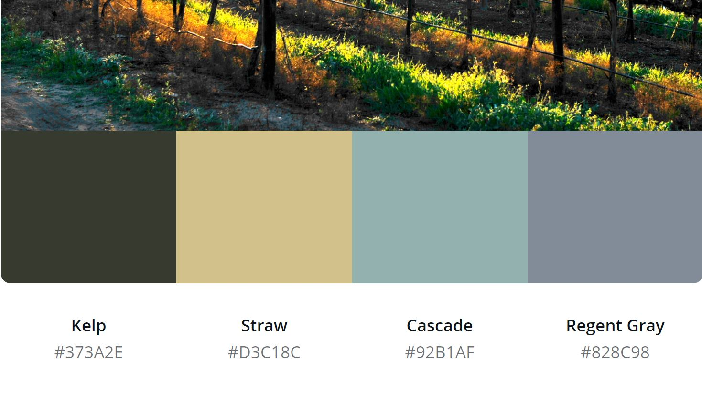

# Cape Wine

Cape Wine is a travel site which encourages both local and international Cape Winelands visitors to discover new places.
This site makes use of the Google Maps API to allow wine lovers to filter by drinking or wine tasting, wine farm restaurants and places to stay for a few nights in the Cape Winelands.
The Cape Winelands is one of the most beautiful areas in South Africa, with the rugged mountains, and practically untouched countryside.
The aim of this site is to show users the options available to locals and tourists when visiting the Cape Winelands

# User Experience

# User stories

- As a user, I want to be able to learn more about the Cape Winelands
- As a user, I want to be able to discover where would be a nice place to drink wine, eat food and stay.
- As a user, I want to be able to contact the site owner if I need more information.
- As a user, I want to be able to easily see a list of options in a table and find out more information on these places located in the Cape Winelands
- As a user, I expect to be able to access the website from any device.
- As a user I expect any information on the website to be displayed in a clear & concise way
- As a user, I expect to find information on the website quickly and effectively.
- As a user, I expect to be able to find out more information about the company.
- As a user, I expect to be able to read reviews from customers.
- As a user, I expect to be able to get in contact with the site owner for any reason
- As a user, I expect to be able to gain additional information on this site owner

# Strategy

My goal of this site is to create a simple, visually appealing website to help travel lovers discover the hidden gems of South Africa by utilising the Google Maps API and Google Maps Documentation.

# Scope

To provide potential customers with information on hotels, restaurants and bars to visit in South Africa, more specially focused on the Cape Winelands

# Structure

The main structure of this website involves three main sections, the ‘Landing page’, the ‘About Us’ section and the ‘Discovery’ section.

The navbar appears and is fixed when the user opens the landing page. The landing image is a beautiful picture, creating a smooth experience for each user. Users can click on the downward arrows, prompting the user to go to the next section, The scroll is smooth using the scroll-behavior: smooth command CSS.
On smaller screens, the navbar collapses using Bootstrap. When that icon is clicked, a dropdown menu with text is opened, allowing the user to easily navigate through the site.

The images contain the Bootstrap img-thumbnail class to ensure both responsiveness and the shadow that accompanies the bootstrap class.

To ensure easy usability, I created buttons for the user to press to filter which activity they would like to know more about.

When a user searches for an activity and city, then a table appears with a list of all activities in the area selected.

The map automatically zooms into the selected city. If a city is not selected and a filter is, then it will drop pins by default to the centre of the country.

# Skeleton

This website is structured over one page, using Google Maps API.
T
he page is split into three core sections.

These are the wireframes, which include both the desktop and mobile view for each section.

1.  [Landing Page](wireframes/landing-capewine.JPG)
2.  [About Us](wireframes/aboutus-capewine.JPG)
3.  [Discovery](wireframes/discover-capewine.JPG)
4.  [Contact Us](wireframes/contactus-capewine.JPG)

# Surface

The colour scheme for this project is minimalistic. I was hoping to create a good link between the landing page and the color scheme throughout the page to keep the page attractive.  

The colours used were:

I used a really handy tool created by [Canva](https://www.canva.com/colors/color-palette-generator/) to generate the color scheme. 

The site makes use of two key fonts :

- Montserrat
- Monospace

# Features

## Existing Features

### Landing Page

This is the first section a user sees upon coming onto the pages.
Users are presented with a landing image the size of the screen and downward arrows, when clicking will bring them to the ‘About Us’ section.

### About Us 

This section gives a breakdown of the site owners experience with the Cape Winelands and why the page came to exist. 

It shares their story and passion for the Cape Wineland, as well as a small amount of information about the Winelands.

The section is split into two cards, with a background image each and overlay text. Each card has a title 

### Discovery 

This section has three core components.

    - Search field with a user input field that has an autocomplete generated by Google, allowing users to filter their city search. Limited within South Africa.
    - Filters. Three buttons filtering by places to drink, eat and sleep. The buttons change color when clicked to help the user navigate the filtering section
    - Results table which displays a list generated by Google to help name the recommendations to the user
    - Google Maps image with markers on the filters activity.

When the user clicks on the markers, more information about the place will appear. 

### Contact Us

This section is split into two components.

    - A summary of the site owners contact information, including their email address, telephone number and physical address.
    - A contact form which the user can fill out to leave the site owner a message.

### Footer

A simple footer where the user can connect to the site owner via social media. The user can follow the links to the Facebook, Twitter and Instagram accounts to keep updated on more current news and blogpost done by the site owner.
